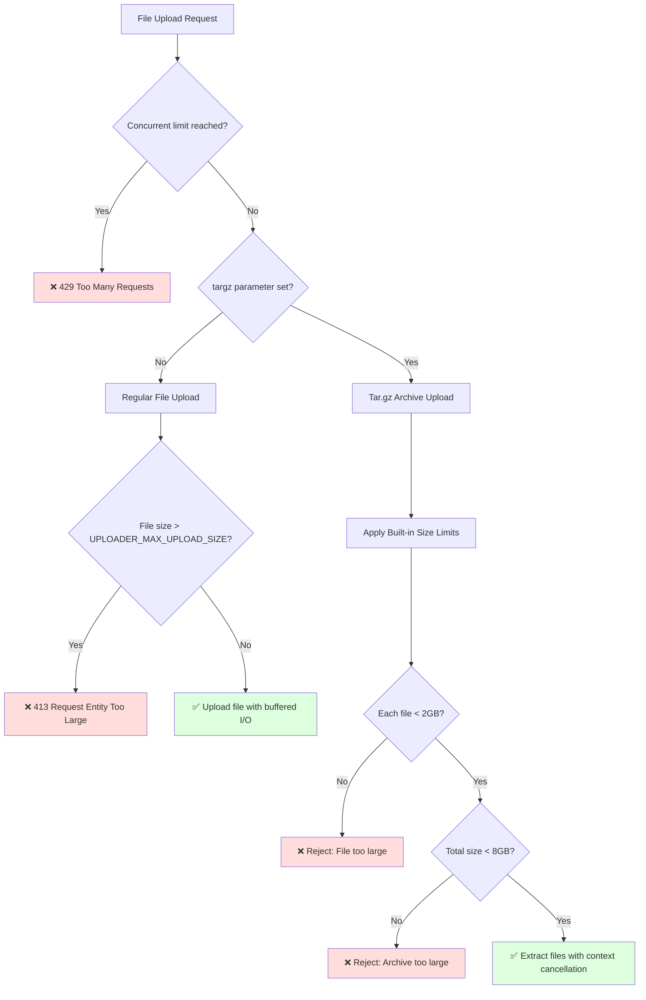

[](/LICENSE)

# KubeRocketCI Cache (krci-cache)

A high-performance caching component for KubeRocketCI pipeline artifacts, built in Go with Echo framework.
Designed for high-load production environments with proper authentication, resource management, and observability.

## Install

```shell
go install github.com/KubeRocketCI/krci-cache
```

### Configuration

Configuration is done via environment variables for production-ready deployments:

#### Basic Configuration

- **UPLOADER_HOST** -- hostname to bind to (default: localhost)
- **UPLOADER_PORT** -- port to bind to (default: 8080)
- **UPLOADER_DIRECTORY** -- Directory where to upload (default: ./pub)
- **UPLOADER_UPLOAD_CREDENTIALS** -- Protect upload/delete endpoints with username:password (e.g: `username:password`)

#### High-Load Configuration

- **UPLOADER_MAX_UPLOAD_SIZE** -- Maximum file size for regular uploads in bytes (default: 0 = unlimited)
- **UPLOADER_MAX_CONCURRENT_UPLOADS** -- Maximum concurrent uploads (default: 10)
- **UPLOADER_REQUEST_TIMEOUT** -- Request timeout duration (default: 30s, format: "30s", "1m", "2h")

#### Production Example

```shell
export UPLOADER_HOST="0.0.0.0"
export UPLOADER_PORT="8080"
export UPLOADER_DIRECTORY="/var/cache/artifacts"
export UPLOADER_UPLOAD_CREDENTIALS="cache-user:secure-password"
export UPLOADER_MAX_UPLOAD_SIZE="1073741824"  # 1GB limit
export UPLOADER_MAX_CONCURRENT_UPLOADS="20"   # 20 concurrent uploads
export UPLOADER_REQUEST_TIMEOUT="5m"          # 5 minute timeout
```

The service should be deployed behind proper authentication and access controls.
Do not expose this directly to the internet without protection.

## High-Load Features

### Performance Optimizations

- **Concurrent Upload Limiting**: Configurable semaphore-based limiting prevents resource exhaustion
- **Context-Aware Operations**: All file operations support cancellation for better resource management
- **Buffered I/O**: 32KB buffers for optimal large file transfer performance
- **Structured Logging**: JSON-formatted logs with request tracing for observability
- **Graceful Shutdown**: Proper signal handling ensures clean shutdown under load

### Observability

- **Health Check Endpoint**: `/health` for load balancer and monitoring integration
- **Request Tracing**: Each request gets a unique ID for debugging and monitoring
- **Structured Metrics**: JSON logs include latency, error rates, and resource usage
- **Comprehensive Error Handling**: Detailed error responses with proper HTTP status codes

### Resource Management

- **Configurable Timeouts**: Request, read, and write timeouts prevent hanging connections
- **Memory Efficiency**: Streaming uploads with controlled buffering
- **File Size Limits**: Configurable limits for regular uploads (tar.gz has built-in limits)
- **Automatic Cleanup**: Proper resource cleanup even during errors or cancellations

## Limitations

The service enforces size limitations **only for tar.gz uploads** for security and resource protection:

### Tar.gz Archive Limits

- **Individual File Size**: Maximum 2GB per file within tar.gz archives
- **Archive Total Size**: Maximum 8GB total uncompressed size for tar.gz uploads
- **Regular File Uploads**: Configurable size limits via `UPLOADER_MAX_UPLOAD_SIZE`
- **Security**: Protects against zip bombs, path traversal, and resource exhaustion attacks

### Practical Examples

**✅ Regular File Uploads (configurable limits):**

- Single 50GB container image (if `UPLOADER_MAX_UPLOAD_SIZE` allows)
- Database dumps, build artifacts, documentation
- Limited by configuration and available disk space

**✅ Tar.gz Archive Uploads (built-in size limits):**

- Archive with 4 × 2GB files = 8GB total uncompressed
- Mixed CI/CD archive: dependency cache (1GB) + build artifacts (2GB) + test data (3GB) + docs (1GB) = 7GB total

**❌ Rejected Scenarios:**

- Regular files larger than `UPLOADER_MAX_UPLOAD_SIZE` (if set)
- Tar.gz archives with individual files larger than 2GB
- Tar.gz archives with total uncompressed content exceeding 8GB
- Archives containing symlinks or path traversal attempts

**See the [Upload Flow Diagram](#upload-flow-diagram) below for a visual representation of how these limitations are applied.**

## Usage

### API Endpoints

#### Health Check

- **method**: GET
- **path**: */health*
- **description**: Health check endpoint for load balancers and monitoring
- **response**: JSON with status, timestamp, and version

```shell
curl http://localhost:8080/health
```

#### Upload

The service accepts HTTP form fields:

- **file**: The file stream of the upload
- **path**: The target path for the file
- **targz**: Set to extract tar.gz archives automatically on the filesystem

#### Response Format

All endpoints return JSON responses for better integration:

```json
{
  "message": "File has been uploaded to example.txt",
  "path": "example.txt",
  "size": 1024
}
```

## Container Deployment

The application is containerized using a multi-architecture approach with pre-built binaries.
The container runs as a non-root user for security.

### Build

Use the provided Dockerfile which supports both amd64 and arm64 architectures:

```shell
docker build --build-arg TARGETARCH=amd64 -t krci-cache .
```

### Production Deployment

```yaml
# docker-compose.yml example
version: '3.8'
services:
  krci-cache:
    image: krci-cache:latest
    ports:
      - "8080:8080"
    environment:
      - UPLOADER_HOST=0.0.0.0
      - UPLOADER_PORT=8080
      - UPLOADER_DIRECTORY=/var/cache/artifacts
      - UPLOADER_UPLOAD_CREDENTIALS=cache-user:secure-password
      - UPLOADER_MAX_UPLOAD_SIZE=2147483648  # 2GB
      - UPLOADER_MAX_CONCURRENT_UPLOADS=25
      - UPLOADER_REQUEST_TIMEOUT=10m
    volumes:
      - ./cache:/var/cache/artifacts
    restart: unless-stopped
    healthcheck:
      test: ["CMD", "curl", "-f", "http://localhost:8080/health"]
      interval: 30s
      timeout: 10s
      retries: 3
```

## Setup

### Run directly

You can run the service directly or use containerization. The default upload credentials are `username:password` for the `/upload` and `/delete` endpoints.

For production deployment, set proper credentials via the `UPLOADER_UPLOAD_CREDENTIALS` environment variable.

### Run with authentication

Set up authentication credentials:

```shell
export UPLOADER_UPLOAD_CREDENTIALS="username:password"
./krci-cache
```

Test the deployment:

```shell
echo "HELLO WORLD" > /tmp/hello.txt
curl -u username:password -F path=hello-upload.txt -X POST -F file=@/tmp/hello.txt http://localhost:8080/upload
curl http://localhost:8080/hello-upload.txt
```

### Production Monitoring

The service provides structured JSON logs for monitoring:

```json
{
  "time": "2024-01-01T12:00:00Z",
  "level": "INFO",
  "msg": "request",
  "method": "POST",
  "uri": "/upload",
  "status": 201,
  "latency": 150000000,
  "remote_ip": "192.168.1.100",
  "request_id": "abc123",
  "error": ""
}
```

Monitor these logs for:
- High latency requests
- Error rates and patterns
- Resource usage patterns
- Concurrent upload metrics

### API

#### Upload

- **method**: POST
- **path**: */upload*
- **arguments**:
  - **path**: Target path for the file (relative to upload directory, directory traversal prevented)
  - **file**: File post data (size limited by `UPLOADER_MAX_UPLOAD_SIZE`)
  - **targz**: Boolean flag to extract tar.gz files on filesystem (tar.gz uploads subject to size limits: max 2GB per file, 8GB total)

- **examples**:

```shell
# Regular file upload (subject to configured limits)
curl -u username:password -F path=hello-upload.txt -X POST -F file=@/tmp/hello.txt http://localhost:8080/upload
```

```shell
# Large file upload (subject to UPLOADER_MAX_UPLOAD_SIZE)
curl -u username:password -F path=large-database.sql -X POST -F file=@/path/to/large-database.sql http://localhost:8080/upload
```

```shell
# Extract tar.gz automatically (max 2GB per file, 8GB total uncompressed)
tar czf - /path/to/directory|curl -u username:password -F path=hello-upload.txt -F targz=true -X POST -F file=@- http://localhost:8080/upload
```

### Delete File

- **method**: DELETE
- **path**: */upload*
- **arguments**:
  - **path**: Path to delete

- **example**:

```shell
curl -u username:password -F path=hello-upload.txt -X DELETE http://localhost:8080/upload
```

### Delete Old Files

- **method**: DELETE
- **path**: */delete*
- **arguments**:
  - **path**: Directory path to clean up
  - **days**: Delete files older than X days
  - **recursive**: Recursively delete in subdirectories (defaults to `false`)

- **example**:

```shell
curl -u username:password -F path=/path/to/directory -F days=1 -F recursive=true -X DELETE http://localhost:8080/delete
```

## Upload Flow Diagram

The following diagram illustrates how file uploads are processed and when size limitations are applied:



**Key Points:**

- Concurrent upload limiting prevents resource exhaustion
- Regular file uploads have configurable size restrictions
- Tar.gz uploads are validated against both individual file size (2GB) and total archive size (8GB)
- All operations support context cancellation for better resource management
- Structured logging provides observability for all operations

## Best Practices for High-Load Deployments

### Resource Planning

1. **Set appropriate upload limits**: Use `UPLOADER_MAX_UPLOAD_SIZE` based on your storage and network capacity
2. **Configure concurrency**: Adjust `UPLOADER_MAX_CONCURRENT_UPLOADS` based on CPU and I/O capacity
3. **Monitor disk space**: Implement external monitoring for the upload directory
4. **Use load balancing**: Deploy multiple instances behind a load balancer for high availability

### Security

1. **Use strong credentials**: Generate secure passwords for `UPLOADER_UPLOAD_CREDENTIALS`
2. **Deploy behind TLS**: Always use HTTPS in production
3. **Network isolation**: Deploy in a secure network environment
4. **Regular updates**: Keep the application and base images updated

### Monitoring

1. **Health checks**: Use the `/health` endpoint for monitoring
2. **Log analysis**: Monitor JSON logs for performance and error patterns
3. **Resource metrics**: Track CPU, memory, and disk usage
4. **Alert on errors**: Set up alerts for 4xx/5xx error rates

## [LICENSE](LICENSE)

[Apache 2.0](LICENSE)
