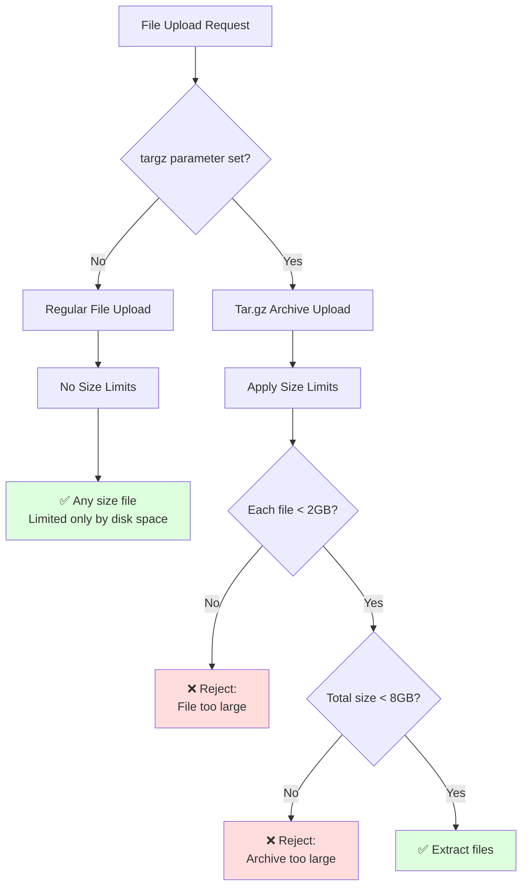

[](/LICENSE)

# KubeRocketCI Cache (krci-cache)

A caching component for KubeRocketCI pipeline artifacts, built in Go with Echo framework.
Designed to be deployed in containers with proper authentication and access controls.

## Install

```shell
go install github.com/KubeRocketCI/krci-cache
```

### Configuration

Configuration is done via environment variables:

- **UPLOADER_HOST** -- hostname to bind to (default: localhost)
- **UPLOADER_PORT** -- port to bind to (default: 8080)
- **UPLOADER_DIRECTORY** -- Directory where to upload (default: ./pub)
- **UPLOADER_UPLOAD_CREDENTIALS** -- Protect upload/delete endpoints with username:password (e.g: `username:password`)

The service should be deployed behind proper authentication and access controls.
Do not expose this directly to the internet without protection.

## Limitations

The service enforces size limitations **only for tar.gz uploads** for security and resource protection:

### Tar.gz Archive Limits

- **Individual File Size**: Maximum 2GB per file within tar.gz archives
- **Archive Total Size**: Maximum 8GB total uncompressed size for tar.gz uploads
- **Regular File Uploads**: No size limits imposed (limited only by available disk space and HTTP server configuration)
- **Security**: Protects against zip bombs, path traversal, and resource exhaustion attacks

### Practical Examples

**✅ Regular File Uploads (no limits):**

- Single 50GB container image or binary file
- Any size database dumps, build artifacts, or documentation
- Only limited by available disk space

**✅ Tar.gz Archive Uploads (size limits apply):**

- Archive with 4 × 2GB files = 8GB total uncompressed
- Mixed CI/CD archive: dependency cache (1GB) + build artifacts (2GB) + test data (3GB) + docs (1GB) = 7GB total

**❌ Rejected Tar.gz Scenarios:**

- Archive with individual files larger than 2GB
- Archive with total uncompressed content exceeding 8GB
- Archives containing symlinks or path traversal attempts

These limits are enforced during tar.gz upload validation and extraction to prevent malicious uploads and resource exhaustion.

**See the [Upload Flow Diagram](#upload-flow-diagram) below for a visual representation of how these limitations are applied.**

## Usage

The service accepts HTTP form fields:

- **file**: The file stream of the upload
- **path**: The target path for the file
- **targz**: Set to extract tar.gz archives automatically on the filesystem

## Container Deployment

The application is containerized using a multi-architecture approach with pre-built binaries.
The container runs as a non-root user for security.

### Build

Use the provided Dockerfile which supports both amd64 and arm64 architectures:

```shell
docker build --build-arg TARGETARCH=amd64 -t krci-cache .
```

## Setup

### Run directly

You can run the service directly or use containerization. The default upload credentials are `username:password` for the `/upload` and `/delete` endpoints.

For production deployment, set proper credentials via the `UPLOADER_UPLOAD_CREDENTIALS` environment variable.

### Run with authentication

Set up authentication credentials:

```shell
export UPLOADER_UPLOAD_CREDENTIALS="username:password"
./krci-cache
```

Test the deployment:

```shell
echo "HELLO WORLD" > /tmp/hello.txt
curl -u username:password -F path=hello-upload.txt -X POST -F file=@/tmp/hello.txt http://localhost:8080/upload
curl http://localhost:8080/hello-upload.txt
```

### API

#### Upload

- **method**: POST
- **path**: */upload*
- **arguments**:
  - **path**: Target path for the file (relative to upload directory, directory traversal prevented)
  - **file**: File post data (no size limits for regular uploads)
  - **targz**: Boolean flag to extract tar.gz files on filesystem (tar.gz uploads subject to size limits: max 2GB per file, 8GB total)

- **examples**:

```shell
# Regular file upload (no size limits)
curl -u username:password -F path=hello-upload.txt -X POST -F file=@/tmp/hello.txt http://localhost:8080/upload
```

```shell
# Large file upload (no size limits)
curl -u username:password -F path=large-database.sql -X POST -F file=@/path/to/50GB-database.sql http://localhost:8080/upload
```

```shell
# Extract tar.gz automatically (max 2GB per file, 8GB total uncompressed)
tar czf - /path/to/directory|curl -u username:password -F path=hello-upload.txt -F targz=true -X POST -F file=@- http://localhost:8080/upload
```

### Delete File

- **method**: DELETE
- **path**: */upload*
- **arguments**:
  - **path**: Path to delete

- **example**:

```shell
curl -u username:password -F path=hello-upload.txt -X DELETE http://localhost:8080/upload
```

### Delete Old Files

- **method**: DELETE
- **path**: */delete*
- **arguments**:
  - **path**: Directory path to clean up
  - **days**: Delete files older than X days
  - **recursive**: Recursively delete in subdirectories (defaults to `false`)

- **example**:

```shell
curl -u username:password -F path=/path/to/directory -F days=1 -F recursive=true -X DELETE http://localhost:8080/delete
```

## Upload Flow Diagram

The following diagram illustrates how file uploads are processed and when size limitations are applied:



**Key Points:**

- Regular file uploads have no size restrictions
- Tar.gz uploads are validated against both individual file size (2GB) and total archive size (8GB)
- Size checks occur before extraction to prevent resource exhaustion
- Path traversal and symlink protections apply to all tar.gz extractions

## [LICENSE](LICENSE)

[Apache 2.0](LICENSE)
